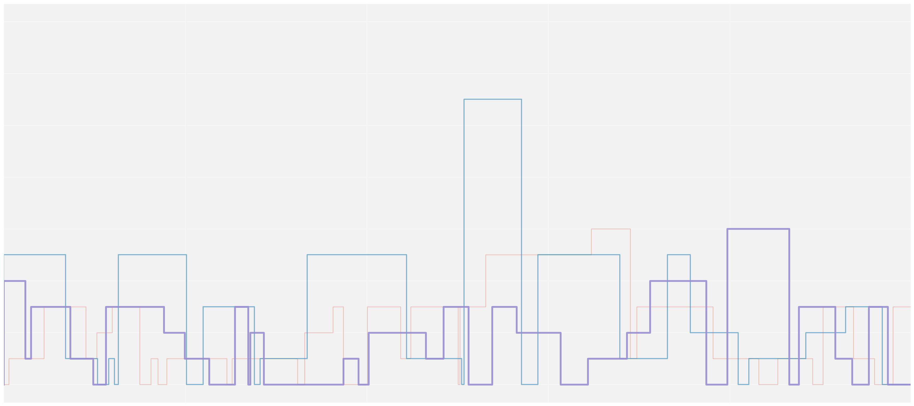

# poisson-skylines

This code uses a continuous time Markov chain similar to the [Poisson
Process](https://en.wikipedia.org/wiki/Poisson_point_process) to draw pictures.
I think that these pictures look a bit like city skylines.

Below is an example. Further examples can be found in the [./tests](./tests)
folder.

## Process Construction

Our pictures are drawn using the following process:

Assume that the process jump times (times at which the height of the bars
change) are exponentially distributed with parameter β. Then, assume that the
state distribution over a time period of Δt is a Poisson distribution with
parameter βΔt.

Practically, it works like this:

- Start at a height of zero.
- Sample Δt from an exponential distribution to discover when the next jump is.
- Sample from a Poisson distribution with parameter βΔt to find the height of
  the bar at time Δt.
- Increment the time to Δt and continue this process until the desired number
  of jumps are made.

The _actual_ Poisson process works exactly like this, but the samples from the
Poisson distribution are _added_ to the current height — they do not _replace_
the current height.
